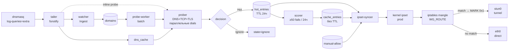

# split-engine

[](https://github.com/belotserkovtsev/split-engine/actions/workflows/ci.yml)
[](https://github.com/belotserkovtsev/split-engine/releases)
[](go.mod)

Умный движок split-маршрутизации для VPN-шлюзов в сетях с DPI.
Наблюдает DNS-трафик клиентов, проверяет доменам достижимость напрямую,
и автоматически отправляет заблокированные через туннель, а остальное —
прямо через провайдера.

Предназначен для гейтов `EN1GMA` / любых WireGuard-шлюзов с `dnsmasq`
и cascading-туннелем наружу.

---

## ⚡ Производительность

Измерено на `ubuntu-latest` в GitHub Actions (2 CPU), probe timeout 200 мс:

| Метрика | Значение |
|---|---|
| **Query → Hot latency** | **~250 мс** (200 мс probe timeout + ~50 мс overhead) |
| **Throughput** | **~65 доменов/с** (inline concurrency = N) |
| **Tailer** | fsnotify (kernel events, sub-ms) |
| **Memory** | ~20 МБ RSS при 500+ доменов |

Замеры воспроизводимы через `go test -run TestPipeline ./internal/engine/`.

В production на jupiter-gateway (800 мс probe timeout) полный цикл
«клиент открыл сайт → IP в kernel ipset» укладывается в **0.3–1.1 секунды**
в зависимости от того, даёт ли DPI мгновенный RST или тихий таймаут.

---

## 🔌 Пайплайн



### Потоки решений

1. **Fast-path** (inline probe):
   dnsmasq пишет `query[A] X.com from peer` → tailer ловит fsnotify-ивент
   (&lt;1 мс) → watcher пишет в `domains` → горутина мгновенно запускает probe,
   не ждёт тикера worker-а.

2. **Batch-path** (probe-worker):
   Каждые 2 с забирает до 4 кандидатов у которых cooldown истёк. Нужен для
   пере-проверки hot-доменов и для случаев когда inline-семафор переполнен.

3. **Scorer**: раз в 10 минут считает `COUNT(probes с fail) за 24ч ≥ 50`
   → промоутит в `cache_entries` (без TTL, переживает экспайр hot).

4. **ipset-syncer**: на каждый Hot-событие через буферный канал —
   моментальный reconcile. Плюс safety-тикер раз в 30 с на случай
   пропущенного события.

---

## 🧭 Состояния домена

```
 new  ──probe──▶  hot  ──≥50 fails/24h──▶  cache  (постоянный)
  │                │
  │                └──expire 24h──▶ out of ipset (если нет cache)
  │
  └──probe direct OK──▶  ignore
```

`manual-allow` и `manual-deny` — явные override-ы оператора:

- `manual-allow` — домен всегда в ipset, probe не нужен.
- `manual-deny` — домен никогда не пробуется и не туннелируется
  (полезно для внутренних/LAN-сервисов).

---

## 📦 Установка

### Требования

- Linux (Debian 11+ / Ubuntu 22.04+ / любой современный dist).
- `iptables` (legacy или nft-режим).
- `ipset`, `iptables-persistent` — `apt install ipset iptables-persistent`.
- `dnsmasq` с `log-queries=extra` и log-facility в файл.
- Рутовые права (нужен доступ к `ipset` и к файлу лога dnsmasq).
- WireGuard-шлюз с fwmark-based routing и туннелем наружу
  (stun0, wg1, hysteria, любой).

### Quickstart

```bash
# 1. Скачать релиз
TAG=v0.1.0
curl -L "https://github.com/belotserkovtsev/split-engine/releases/download/${TAG}/split-engine-linux-amd64.tar.gz" \
  | sudo tar -xz -C /opt

sudo mv /opt/split-engine-linux-amd64-${TAG} /opt/split-engine
sudo mkdir -p /opt/split-engine/state /etc/split-engine

# 2. Примеры manual-списков
sudo cp /opt/split-engine/manual-allow.txt.example /etc/split-engine/manual-allow.txt
sudo cp /opt/split-engine/manual-deny.txt.example  /etc/split-engine/manual-deny.txt

# 3. Создать ipset и правило в iptables mangle
sudo ipset create prod hash:ip family inet maxelem 65536
sudo iptables -t mangle -A WG_ROUTE -m set --match-set prod dst \
  -j MARK --set-mark 0x1
sudo ipset save > /etc/iptables/ipsets   # чтобы переживало reboot

# 4. Инициализировать БД и поставить сервис
sudo /opt/split-engine/split-engine \
  -db /opt/split-engine/state/engine.db init-db
sudo install -m 0644 /opt/split-engine/split-engine.service \
  /etc/systemd/system/
sudo systemctl daemon-reload
sudo systemctl enable --now split-engine

# 5. Проверить
systemctl status split-engine
journalctl -u split-engine -f
```

Подробнее — см. [release/INSTALL.md](release/INSTALL.md).

---

## 🛠 Конфигурация

Все флаги передаются через systemd unit (`/etc/systemd/system/split-engine.service`):

```
split-engine -db <path> run [-from-start] [-manual-allow <path>] [-manual-deny <path>] <dnsmasq-log-path>
```

Внутри [`internal/engine/engine.go`](internal/engine/engine.go) в `Defaults()`:

| Параметр | Значение | Смысл |
|---|---|---|
| `ProbeTimeout` | 800 мс | Макс. время на TCP/TLS dial |
| `ProbeCooldown` | 5 мин | Минимальный интервал между probe одного домена |
| `InlineProbeConcurrency` | 8 | Семафор для inline probes из tailer |
| `HotTTL` | 24 ч | Срок жизни записи в `hot_entries` |
| `IpsetInterval` | 30 с | Safety-реконсил ipset (помимо event-driven) |
| `DNSFreshness` | 6 ч | Сколько часов IP из dns_cache считается актуальным |
| `Scorer.Window` | 24 ч | Окно для подсчёта fails |
| `Scorer.FailThreshold` | 50 | Порог fails для промоушна hot → cache |
| `Scorer.Interval` | 10 мин | Как часто scorer проходится |

---

## 🔍 Наблюдаемость

Вся state-data живёт в SQLite. Полезные запросы:

```bash
DB=/opt/split-engine/state/engine.db

# Распределение по состояниям
sqlite3 "$DB" "SELECT state, COUNT(*) FROM domains GROUP BY state"

# Топ-15 «горячих» доменов по количеству визитов
sqlite3 -column "$DB" \
  "SELECT domain, hit_count, state FROM domains
   WHERE state IN ('hot','cache')
   ORDER BY hit_count DESC LIMIT 15"

# Сколько IP в kernel ipset
sudo ipset list prod -t | grep entries

# Причины попадания в hot
sqlite3 -column "$DB" \
  "SELECT d.domain, p.failure_reason, p.latency_ms
   FROM domains d JOIN probes p ON p.id = d.last_probe_id
   WHERE d.state = 'hot' ORDER BY p.created_at DESC LIMIT 20"

# Промоушны в cache за последний час
sqlite3 -column "$DB" \
  "SELECT domain, promoted_at, reason FROM cache_entries
   WHERE promoted_at > datetime('now','-1 hour')"
```

Live-логи engine: `journalctl -u split-engine -f`.

---

## 🏗 Разработка

```sh
# Unit + race-тесты (быстро, без сети)
go test -race -short ./...

# Полные пайплайн-перфтесты (живые TCP timeout-ы на RFC5737 192.0.2.1)
go test -v -run TestPipeline ./internal/engine/

# Кросс-компиляция под Linux
GOOS=linux GOARCH=amd64 go build -o dist/split-engine ./cmd/split-engine
```

### Структура пакетов

| Путь | Ответственность |
|---|---|
| `cmd/split-engine/` | CLI: `init-db`, `run`, `probe`, `observe`, `list`, `hot`, `tail` |
| `internal/tail/` | fsnotify-based follower для dnsmasq-лога |
| `internal/dnsmasq/` | Парсер log-строк (query / reply / cached / forwarded) |
| `internal/watcher/` | Нормализация и ingest DNS-событий |
| `internal/storage/` | SQLite access layer + embedded schema |
| `internal/etld/` | Wrapper над `golang.org/x/net/publicsuffix` |
| `internal/prober/` | Probe: параллельные TCP + TLS-SNI с `InsecureSkipVerify` |
| `internal/decision/` | Классификация probe → {Ignore, Watch, Hot} |
| `internal/scorer/` | Promote hot → cache по количеству fails в окне |
| `internal/manual/` | Загрузчик allow/deny-списков из файлов |
| `internal/ipset/` | Обёртка над CLI `ipset` (Add/Del/Reconcile/Save) |
| `internal/publisher/` | Atomic-write текстового файла с hot-доменами |
| `internal/engine/` | Вся оркестровка: 6 горутин, каналы, lifecycle |

### CI

[GitHub Actions workflow](.github/workflows/ci.yml) прогоняет на каждый push
в `main` и каждый PR:

- `go build ./...`
- `go vet ./...`
- `go test -race -short ./...` (unit + race-detector)
- `go test -run TestPipeline ./internal/engine/` (end-to-end перфтесты)

---

## 📜 Лицензия

Пока private — будет определено при публикации.
