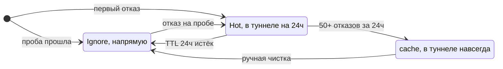
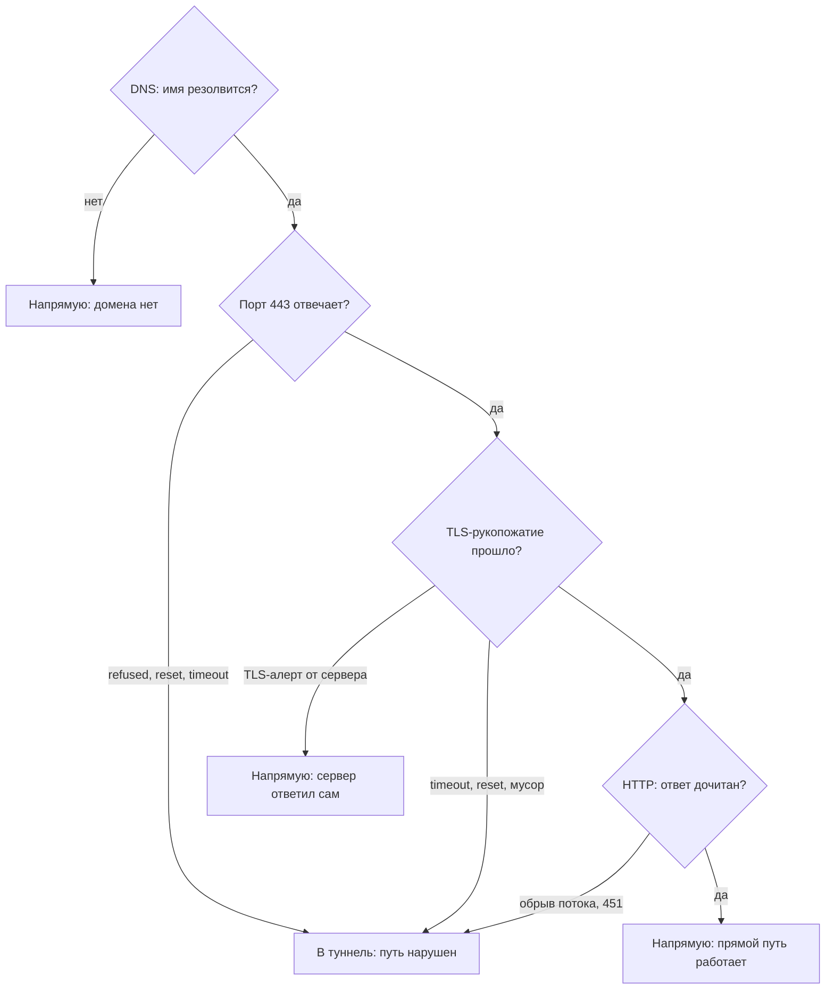

# Методология: как Ladon решает, что блокировано

← [README](../README.md) · [конфигурация](configuration.md) · [установка](install.md) · [extensions](extensions.md) · [probe API](probe-api.md)

Ladon не носит с собой список заблокированных сайтов. Вместо списка он ставит
эксперимент. Для каждого домена, который запросили твои устройства, он сам пробует
подключиться (так же, как это сделал бы браузер) и смотрит, как именно не
получилось. По характеру обрыва он и решает, что делать с доменом.

Этот документ разбирает, как из живого сетевого поведения рождается вердикт
«в туннель» или «напрямую».

> **DPI** (Deep Packet Inspection): оборудование на стороне провайдера. Оно
> разбирает твой трафик и видит, к какому сайту ты идёшь. Перекрыть доступ оно
> может по-разному: молча оборвать соединение, сбросить его поддельным пакетом,
> подменить ответ. Ladon борется не с самим DPI, а с его последствиями: находит,
> что именно у тебя не открывается, и уводит такой трафик в твой туннель.

## Вердикт: в туннель или напрямую

Что бы Ladon ни выяснил про домен, итог сводится к одному из двух действий.

- **В туннель.** Адреса домена попадают в список в ядре (`ipset`), а твои правила
  маршрутизации заворачивают этот трафик в VPN. Свежее решение помечается как
  `Hot`: домен в туннеле, живёт 24 часа и периодически перепроверяется. Если за
  сутки накапливается устойчивая серия отказов (порог 50+ за сутки, подробнее
  ниже), домен переходит в `cache`: постоянный туннелируемый список без срока
  годности.
- **Напрямую.** Ladon ничего не делает, домен ходит обычным маршрутом. Это
  состояние называется `Ignore`.

> `ipset` хранит список адресов прямо в ядре Linux. По нему сетевой фильтр решает,
> какой пакет отправить в туннель. Ladon здесь только «мозг»: он решает, какие
> адреса добавить в список. Сам разворот трафика делает твоя маршрутизация,
> которая уже работает в твоём VPN. Если туннель ты поднимал по готовому гайду,
> досборка минимальна и описана в [установке](install.md).

Короткие имена дальше по тексту: `Hot` и `cache` означают «в туннеле», `Ignore`
означает «напрямую».

## Откуда берутся домены: реактивная подписка

Ladon проверяет только те домены, к которым твои устройства уже обращались. На
пробу попадает имя из живого DNS-трафика, а не из заранее составленного списка
«топ заблокированных». Поэтому покрытие совпадает с тем, чем ты реально
пользуешься: проверяется ровно то, что кто-то открыл, и ничего лишнего.

Технически Ladon читает лог DNS-сервера шлюза (`dnsmasq`) и берёт оттуда имена,
которые запросили клиенты. Нет запроса, нет и кандидата на пробу.

## Проба: четыре стадии

Одна проба состоит из четырёх независимых проверок. Они идут по порядку и
обрываются на первой же неудаче:

1. **DNS.** Резолвится ли имя в адрес.
2. **TCP:443.** Проходит ли запрос на соединение (SYN) и отвечает ли хост.
3. **TLS-рукопожатие.** Удаётся ли клиенту и серверу договориться о шифровании,
   прежде чем передавать данные.
4. **HTTP-чтение.** После успешного рукопожатия Ladon отправляет обычный `GET`
   и пытается прочитать первые ~32 КБ ответа.

Каждая стадия даёт «прошла» или «не прошла», а при неудаче ещё и категорию отказа
(`tcp_timeout`, `tls_alert`, `http_cutoff` и т. п.). Категория важнее самого
факта: она говорит, почему не получилось.

> **SNI**: имя сайта, которое клиент открыто называет в начале TLS-рукопожатия.
> Именно по нему DPI чаще всего и понимает, куда ты идёшь. Проба подставляет то же
> имя, чтобы видеть сеть так же, как её видит твой браузер.

## Сервер ответил сам или путь молчит

Домен может не открываться по двум совершенно разным причинам, и туннель помогает
только в одной из них:

- **Сервер отказал сам.** Тогда он недоступен в принципе, и через туннель тоже не
  заработает. Тащить его в VPN бессмысленно.
- **Путь до сервера нарушен.** Сервер живой, но что-то между тобой и им рвёт
  соединение. Вот здесь туннель и помогает.

Ladon различает эти два случая по тому, как обрывается соединение.

Когда сервер отвечает сам, домен уходит напрямую. Есть один сигнал, которому можно
верить безоговорочно: типизированный TLS-алерт от сервера.

> **TLS-алерт**: стандартное сообщение об ошибке внутри TLS («handshake failure»,
> «illegal parameter» и т. п.). Частный случай называется **mTLS**: сервер требует,
> чтобы клиент предъявил свой сертификат (так делают Apple Push, FindMy,
> iCloud Private Relay).

Прислать корректный TLS-алерт может только живой сервер, который успел договориться
с нами о шифровании. Оборудованию на пути это не по силам: оно обычно только
подсматривает трафик и рвёт соединение, а вести полноценный шифрованный разговор,
чтобы прислать настоящий алерт, не умеет. Поэтому алерт читается как политика
самого сервиса, а не как блокировка, и домен сразу уходит в `Ignore`. Сюда же
относится случай, когда имя вообще не резолвится: туннелировать нечего.

Когда нарушен путь, домен уходит в туннель. Так Ladon трактует всё остальное:
таймаут на любой стадии, сброс соединения (RST), молчаливый обрыв, обрезанный на
середине HTTP-ответ, мусор вместо TLS, ответ `451`. С точки зрения пользователя
домен просто не работает, и действие по умолчанию (увести его в туннель) верное:
либо туннель поможет (это был блок или геоблокировка), либо не навредит, ведь
мёртвый сервер останется мёртвым и через туннель.

> Геоблокировка: сервис сам закрывает доступ для целой страны или региона.

> **RST**: служебный TCP-пакет «сброс», который мгновенно обрывает соединение.
> Прислать его может и сам сервер, и оборудование на пути, поэтому сам по себе RST
> не доказывает, что отвечал именно сервер.

Важная деталь, которую часто понимают наоборот: `connection refused` и сброс (RST)
означают «в туннель», а не «сервер жив». DPI часто впрыскивает поддельный RST,
чтобы оборвать соединение до того, как оно установится. Поэтому отказ на уровне
TCP Ladon считает признаком помехи, а не доказательством, что сервер закрыл порт.
Исключение только одно: корректный TLS-алерт, подделать который на лету DPI не
может.

С одной точки наблюдения нельзя со стопроцентной точностью отличить DPI от других
причин с тем же симптомом (сервер прилёг, геоблокировка на всю страну, защита от
ботов отбила пробу). Но действие от этого не меняется. А если тебе важно
дополнительно отсеивать случаи, где домен не работает из-за самого сервера, а не
из-за пути, сверху включается второй наблюдатель (см. ниже).

## Все коды отказа

Полный перечень категорий по стадиям. Колонка «класс» отвечает на вопрос, сервер
ответил сам или путь нарушен; колонка «вердикт» говорит, что делает Ladon.

| Код | Стадия | Что случилось | Класс | Вердикт |
|---|---|---|---|---|
| `dns_nxdomain` | DNS | имени не существует |  | напрямую |
| `dns_timeout` | DNS | резолвер не ответил |  | напрямую |
| `dns_error` | DNS | прочая ошибка резолва |  | напрямую |
| `no_ips` | DNS | имя есть, но нет IPv4-адресов |  | напрямую |
| `tcp_refused` | TCP | соединение отклонено (RST на SYN) | путь | в туннель |
| `tcp_reset` | TCP | соединение сброшено | путь | в туннель |
| `tcp_timeout` | TCP | нет ответа на SYN | путь | в туннель |
| `tcp_unreachable` | TCP | сеть или хост недостижимы | путь | в туннель |
| `tcp_error` | TCP | прочая ошибка TCP | путь | в туннель |
| `tls_handshake_timeout` | TLS | рукопожатие зависло | путь | в туннель |
| `tls_eof` | TLS | соединение молча закрылось | путь | в туннель |
| `tls_reset` | TLS | сброс во время рукопожатия | путь | в туннель |
| `tls_garbage` | TLS | вместо TLS пришёл мусор (инъекция оборудования) | путь | в туннель |
| `tls13_block` | TLS | 1.3 не прошёл, а 1.2 прошёл (DPI смотрит ClientHello) | путь | в туннель |
| `tls_error` | TLS | прочая ошибка TLS | путь | в туннель |
| `tls_alert` | TLS | сервер прислал типизированный алерт | сервер | напрямую |
| `mtls_required` | TLS | сервер требует клиентский сертификат | сервер | напрямую |
| `http_cutoff` | HTTP | поток оборван после рукопожатия | путь | в туннель |
| `http_timeout` | HTTP | ответ не пришёл вовремя | путь | в туннель |
| `http_reset` | HTTP | сброс во время ответа | путь | в туннель |
| `http_451` | HTTP | вернулся `451` (юридическая блокировка) | путь | в туннель |
| `http_error` | HTTP | прочая ошибка HTTP | путь | в туннель |
| `remote_unreachable` |  | внешний пробер недоступен (не вердикт о домене) |  | сохраняется локальный вердикт |

Два кода стоит пояснить отдельно:

- **`tls13_block`.** Имя сайта (SNI) едет в первом сообщении рукопожатия, которое
  называется **ClientHello**. В TLS 1.2 оно передаётся открытым текстом, а в
  TLS 1.3 его можно зашифровать. Поэтому DPI, который ловит сайты по имени, часто
  режет именно 1.3 и оставляет 1.2. Если рукопожатие по 1.3 не прошло, а повторное
  по 1.2 прошло и сервер ответил, это почти наверняка такой DPI. Браузеры по
  умолчанию ходят по 1.3, так что для тебя это реальная блокировка.
- **`http_cutoff`.** Рукопожатие прошло, но поток обрывается уже на самом ответе.
  Это сигнатура DPI, который работает на уровне приложения (так блокируют,
  например, LinkedIn и Instagram). Если бы Ladon смотрел только на TCP и TLS, он
  бы такие домены пропустил и посчитал рабочими. Поэтому успешное рукопожатие ещё
  не значит, что домен открывается.

## Одна проба ничего не доказывает

Сервер мог быть перегружен ровно в этот момент, DPI мог сработать нестабильно,
провайдер мог перезагрузить промежуточное оборудование. Поэтому над вердиктом
одной пробы стоит накопительный слой:

- Первый же отказ «в туннель» отправляет домен в `Hot` на 24 часа. Он
  туннелируется и продолжает перепроверяться.
- Если за сутки накапливается 50+ подтверждённых блокировок (при перепроверке раз
  в 5 минут это примерно 4 часа непрерывного отказа), блок считается устойчивым, и
  домен переходит в постоянный список `cache` без срока годности.
- Если за сутки столько не набралось, срок `Hot` истекает, и домен возвращается в
  обычный цикл проб.

Так случайные сбои у провайдера и кратковременные перебои DPI не доходят до
постоянного списка. Порог 50 настраивается (см. [конфигурацию](configuration.md)).

## Второй наблюдатель: exit-compare (опционально)

Локального вердикта «путь нарушен, значит в туннель» уже достаточно для нормальной
работы. Второй наблюдатель работает как отдельный режим, в конфиге он называется
`exit-compare`. Он нужен, только если ты хочешь дополнительно отсеивать один
шумный класс: домен не работает не из-за DPI, а потому что у самого сервера или
CDN проблемы. Тащить такой домен в туннель бесполезно (через туннель он тоже не
заработает) и только засоряет список.

> CDN: сеть серверов, которая раздаёт контент с ближайшей к пользователю точки.

Идея простая: вторая независимая точка наблюдения. Это та же проба, но из другого
места: с арендованного сервера у другого провайдера, в другом регионе. Сравнив два
результата, получаем понятную картину:

| Локальная проба | Внешний пробер | Вердикт | Почему |
|---|---|---|---|
| прошла | не вызывается | напрямую | прямой путь работает, туннель не нужен |
| отказ | прошла полностью | в туннель | снаружи домен живой, значит режут именно у тебя, это DPI |
| отказ | тоже отказ | напрямую | не работает из обеих точек, значит проблема у сервера, не в пути |
| отказ | недоступен | в туннель | мнения нет, остаётся локальный вердикт |

Внешний пробер вызывается только после того, как локальная проба уже сказала
«отказ». Если прямой путь работает, тоннелировать нечего, и спрашивать вторую
точку незачем. Сравнение идёт по стадиям: если обе точки спотыкаются на одной и
той же стадии (типичный случай: обрыв HTTP-потока у защиты от ботов или
геоограниченного API), это проблема сервера, а не пути.

Отдельного слова заслуживает последняя строка. Если внешний пробер просто
недоступен (таймаут, сеть, не-200), Ladon не трактует это как «снаружи тоже не
работает» и сохраняет локальный вердикт. Иначе падение пробера тихо сняло бы
туннель со всех реально заблокированных доменов. Пока exit-compare выключен или
недоступен, Ladon работает ровно как в обычном режиме.

Контракт пробер-сервера и формат запроса и ответа описаны в [probe API](probe-api.md).

## Из чего складывается решение

Вердикт по домену опирается на несколько независимых сигналов:

1. **На какой стадии упала проба.** DNS, TCP, TLS или HTTP.
2. **Характер отказа.** Сервер ответил сам (тогда напрямую) или путь нарушен
   (тогда в туннель). Этот слой отсекает сервисы, которые сами требуют сертификат
   или присылают TLS-алерт.
3. **Накопление во времени.** В постоянный список домен попадает только после
   устойчивой серии отказов. Этот слой отсекает случайные сбои провайдера и
   кратковременные перебои DPI.
4. **Второй наблюдатель (опционально).** Режим exit-compare. Отсекает случаи, где
   домен не работает из-за самого сервера или широкой геоблокировки, а не из-за
   пути.

Первые три слоя работают всегда, четвёртый включается только в режиме
`exit-compare`. В обычном режиме домен попадает в постоянный список, пройдя три
фильтра; с включённым exit-compare их четыре.

## Чего Ladon не ловит

У метода есть честные границы. Вот случаи, которые он по своей природе не различает:

1. **Различение по отпечатку рукопожатия.** Некоторые DPI блокируют не сам сайт, а
   конкретный «почерк» клиента, например ClientHello браузера Chrome, пропуская
   другие. Проба здоровается по-своему, и если её почерк DPI не блокирует, она
   видит «работает», а браузер пользователя нет. Лечится вручную: добавь такой
   домен в список постоянного туннелирования `manual-allow`
   (см. [конфигурацию](configuration.md)).
2. **Замедление вместо блокировки.** DPI не рвёт соединение, а душит скорость.
   Проба видит «медленно, но работает» и оставляет домен напрямую. Чтобы это
   поймать, нужна отдельная проба на устойчивую пропускную способность, а её пока
   нет.
3. **Соединения без DNS.** Часть сервисов после первого подключения ходит на
   «голые» IP, минуя DNS: клиент Telegram к дата-центрам, голос Discord, звонки
   WhatsApp, P2P в Steam. Реактивная подписка живёт на наблюдении за DNS: нет
   запроса, нет кандидата на пробу. Известные диапазоны адресов (CIDR) можно
   загрузить заранее через [extensions](extensions.md), и они попадают в
   маршрутизацию напрямую, минуя пробу.
4. **Подмена DNS.** DPI травит DNS-сервер провайдера и отдаёт клиенту неверные
   адреса. Проба резолвит через другой DNS, видит правильный адрес и не замечает
   подмены, которую видит клиент. Чтобы это ловить, нужна параллельная проба через
   DNS провайдера и сравнение ответов.

---

← [README](../README.md) · [конфигурация](configuration.md) · [установка](install.md) · [extensions](extensions.md) · [probe API](probe-api.md)
